# Open CoScientist Agents Architecture

## Agent Communication & Workflow Diagram

```mermaid
graph TB
    %% Main Orchestration Layer
    subgraph "🎯 Main Orchestration"
        USER[👤 User Input<br/>Research Goal]
        FRAMEWORK[🏗️ CoscientistFramework<br/>Main Controller]
        SUPERVISOR[🧠 Supervisor Agent<br/>Strategic Decision Maker]
    end

    %% Global State Management
    subgraph "💾 Global State Manager"
        STATE[📊 CoscientistStateManager<br/>Central State Coordinator]
        PERSISTENCE[💾 State Persistence<br/>Auto-save Checkpoints]
    end

    %% Core Research Agents
    subgraph "📚 Research Agents"
        LIT_REVIEW[📖 Literature Review Agent<br/>GPT Researcher Integration]
        GENERATION[💡 Generation Agents<br/>Independent & Collaborative]
        REFLECTION[🔍 Reflection Agents<br/>Deep Verification]
        EVOLUTION[🔄 Evolution Agents<br/>Hypothesis Refinement]
        META_REVIEW[📋 Meta-Review Agent<br/>Synthesis & Analysis]
        FINAL_REPORT[📄 Final Report Agent<br/>Comprehensive Summary]
    end

    %% Supporting Systems
    subgraph "🛠️ Supporting Systems"
        TOURNAMENT[🏆 ELO Tournament<br/>Hypothesis Ranking]
        PROXIMITY[🔗 Proximity Graph<br/>Semantic Relationships]
        CONFIG[⚙️ Configuration Agent<br/>System Setup]
    end

    %% Error Handling & Validation
    subgraph "⚠️ Error Handling & Validation"
        VALIDATION[✅ Response Validation<br/>Catastrophic Failure Detection]
        ROBUST_PARSING[🔧 Robust Parsing<br/>Self-Healing LLM Parsing]
        CONFIG_VALIDATION[🔍 Config Validation<br/>Real API Testing]
    end

    %% Communication Flow
    USER --> FRAMEWORK
    FRAMEWORK --> STATE
    FRAMEWORK --> SUPERVISOR
    
    %% Supervisor Decision Loop
    SUPERVISOR -->|"Decides Next Action"| FRAMEWORK
    FRAMEWORK -->|"Execute Action"| LIT_REVIEW
    FRAMEWORK -->|"Execute Action"| GENERATION
    FRAMEWORK -->|"Execute Action"| REFLECTION
    FRAMEWORK -->|"Execute Action"| EVOLUTION
    FRAMEWORK -->|"Execute Action"| TOURNAMENT
    FRAMEWORK -->|"Execute Action"| META_REVIEW
    FRAMEWORK -->|"Execute Action"| FINAL_REPORT

    %% State Communication (All agents read/write to state)
    LIT_REVIEW <--> STATE
    GENERATION <--> STATE
    REFLECTION <--> STATE
    EVOLUTION <--> STATE
    META_REVIEW <--> STATE
    FINAL_REPORT <--> STATE
    TOURNAMENT <--> STATE
    PROXIMITY <--> STATE

    %% Error Handling Integration
    VALIDATION -.->|"Validates All LLM Responses"| LIT_REVIEW
    VALIDATION -.->|"Validates All LLM Responses"| GENERATION
    VALIDATION -.->|"Validates All LLM Responses"| REFLECTION
    VALIDATION -.->|"Validates All LLM Responses"| EVOLUTION
    VALIDATION -.->|"Validates All LLM Responses"| META_REVIEW
    VALIDATION -.->|"Validates All LLM Responses"| FINAL_REPORT
    VALIDATION -.->|"Validates All LLM Responses"| SUPERVISOR

    ROBUST_PARSING -.->|"Self-Healing Parsing"| GENERATION
    ROBUST_PARSING -.->|"Self-Healing Parsing"| REFLECTION
    ROBUST_PARSING -.->|"Self-Healing Parsing"| EVOLUTION

    CONFIG_VALIDATION -.->|"Validates Configuration"| FRAMEWORK

    %% Persistence
    STATE --> PERSISTENCE

    %% Styling
    classDef mainAgent fill:#e1f5fe,stroke:#01579b,stroke-width:3px
    classDef researchAgent fill:#f3e5f5,stroke:#4a148c,stroke-width:2px
    classDef supportAgent fill:#e8f5e8,stroke:#1b5e20,stroke-width:2px
    classDef errorAgent fill:#ffebee,stroke:#b71c1c,stroke-width:2px
    classDef stateAgent fill:#fff3e0,stroke:#e65100,stroke-width:2px

    class FRAMEWORK,SUPERVISOR mainAgent
    class LIT_REVIEW,GENERATION,REFLECTION,EVOLUTION,META_REVIEW,FINAL_REPORT researchAgent
    class TOURNAMENT,PROXIMITY,CONFIG supportAgent
    class VALIDATION,ROBUST_PARSING,CONFIG_VALIDATION errorAgent
    class STATE,PERSISTENCE stateAgent
```

## Agent Communication Patterns

### 🔄 **Communication Architecture**

**1. Centralized State Management**
- **Single Source of Truth**: `CoscientistStateManager` coordinates all agent communication
- **No Direct Agent-to-Agent Communication**: Agents only communicate through shared state
- **State Persistence**: Auto-save checkpoints after every operation

**2. Supervisor-Driven Orchestration**
- **Strategic Decision Making**: Supervisor analyzes system state and decides next action
- **Action Execution**: Framework executes supervisor decisions sequentially
- **Iteration Control**: Maximum 20 iterations to prevent infinite loops

**3. Agent Categories**

#### 🎯 **Main Agents (Orchestration)**
- **Supervisor Agent**: Strategic decision maker, analyzes state, chooses next action
- **Framework**: Main controller, executes supervisor decisions

#### 📚 **Research Agents (Core Work)**
- **Literature Review Agent**: Uses GPT Researcher for systematic literature analysis
- **Generation Agents**: Create hypotheses (Independent/Collaborative modes)
- **Reflection Agents**: Deep verification and causal reasoning
- **Evolution Agents**: Refine hypotheses based on feedback
- **Meta-Review Agent**: Synthesize insights across research directions
- **Final Report Agent**: Generate comprehensive summaries

#### 🛠️ **Supporting Agents (Tools)**
- **ELO Tournament**: Rank hypotheses through competitive analysis
- **Proximity Graph**: Track semantic relationships between hypotheses
- **Configuration Agent**: System setup and parameter configuration

### ⚠️ **Error Handling & Resilience**

#### **Catastrophic Failure Philosophy**
- **Fail Fast**: System crashes immediately on configuration errors
- **No Silent Failures**: Empty LLM responses cause immediate crashes
- **Validation at Every Step**: All LLM responses validated before processing

#### **Self-Healing Mechanisms**
- **Robust Parsing**: LLM-based parsing with retry logic and fallbacks
- **Token Limit Handling**: Intelligent text compaction when hitting limits
- **Structured Output**: Direct JSON output with validation error feedback

#### **Configuration Validation**
- **Real API Testing**: Configuration validation makes actual API calls
- **Provider Validation**: Tests OpenAI, Google, Anthropic API access
- **Model Validation**: Verifies model names and token limits

### 🔧 **What's Missing (Your Concerns)**

#### **Graceful Communication**
- ❌ **No Retry Logic**: Agents don't retry failed operations
- ❌ **No Circuit Breakers**: No protection against cascading failures
- ❌ **No Timeout Handling**: Operations can hang indefinitely
- ❌ **No Backoff Strategies**: No exponential backoff for API failures

#### **Error Recovery**
- ❌ **No Partial Recovery**: System doesn't recover from partial failures
- ❌ **No State Rollback**: No mechanism to rollback to previous state
- ❌ **No Alternative Paths**: No fallback strategies when agents fail

#### **Monitoring & Observability**
- ❌ **No Health Checks**: No monitoring of agent health
- ❌ **No Performance Metrics**: No tracking of agent performance
- ❌ **No Failure Analysis**: No analysis of failure patterns

### 🚨 **Critical Issues**

1. **Single Point of Failure**: Supervisor agent failure stops entire system
2. **No Parallel Execution**: All operations are sequential
3. **No Load Balancing**: No distribution of work across multiple instances
4. **No Rate Limiting**: No protection against API rate limits
5. **No Dead Letter Queues**: Failed operations are lost

### 💡 **Recommended Improvements**

1. **Add Retry Logic**: Implement exponential backoff for API calls
2. **Add Circuit Breakers**: Prevent cascading failures
3. **Add Timeout Handling**: Set reasonable timeouts for all operations
4. **Add Health Monitoring**: Track agent health and performance
5. **Add Parallel Execution**: Allow concurrent agent operations
6. **Add State Rollback**: Implement checkpoint-based recovery
7. **Add Alternative Paths**: Implement fallback strategies for critical operations

This architecture prioritizes **reliability over resilience** - it fails fast and loud rather than attempting graceful recovery, which can be problematic for long-running research processes.
