# Open CoScientist Agents Architecture

## Functional Agent Flow Diagram

```mermaid
graph TB
    %% User Input
    USER[👤 User Input<br/>Research Goal]
    
    %% Main Orchestration
    FRAMEWORK[🏗️ CoscientistFramework<br/>Main Controller]
    SUPERVISOR[🧠 Supervisor Agent<br/>Strategic Decision Maker]
    
    %% Global State
    STATE[📊 Global State Manager<br/>Central Coordination]
    
    %% Core Research Agents
    LIT_REVIEW[📖 Literature Review Agent<br/>Systematic Literature Analysis]
    GENERATION[💡 Generation Agents<br/>Independent & Collaborative]
    REFLECTION[🔍 Reflection Agents<br/>Deep Verification]
    EVOLUTION[🔄 Evolution Agents<br/>Hypothesis Refinement]
    META_REVIEW[📋 Meta-Review Agent<br/>Synthesis & Analysis]
    FINAL_REPORT[📄 Final Report Agent<br/>Comprehensive Summary]
    
    %% Supporting Systems
    TOURNAMENT[🏆 ELO Tournament<br/>Hypothesis Ranking]
    PROXIMITY[🔗 Proximity Graph<br/>Semantic Relationships]
    
    %% Main Flow
    USER --> FRAMEWORK
    FRAMEWORK --> STATE
    FRAMEWORK --> SUPERVISOR
    
    %% Hardcoded Workflow Execution
    SUPERVISOR -->|"Chooses from 6<br/>Hardcoded Actions"| FRAMEWORK
    FRAMEWORK -->|"Static Method Call<br/>generate_new_hypotheses()"| GENERATION
    FRAMEWORK -->|"Static Method Call<br/>evolve_hypotheses()"| EVOLUTION
    FRAMEWORK -->|"Static Method Call<br/>run_tournament()"| TOURNAMENT
    FRAMEWORK -->|"Static Method Call<br/>run_meta_review()"| META_REVIEW
    FRAMEWORK -->|"Static Method Call<br/>expand_literature_review()"| LIT_REVIEW
    FRAMEWORK -->|"Static Method Call<br/>finish()"| FINAL_REPORT
    
    %% State Communication (All agents read/write to state)
    LIT_REVIEW <-->|"Read/Write"| STATE
    GENERATION <-->|"Read/Write"| STATE
    REFLECTION <-->|"Read/Write"| STATE
    EVOLUTION <-->|"Read/Write"| STATE
    META_REVIEW <-->|"Read/Write"| STATE
    FINAL_REPORT <-->|"Read/Write"| STATE
    TOURNAMENT <-->|"Read/Write"| STATE
    PROXIMITY <-->|"Read/Write"| STATE
    
    %% Supervisor reads state for decisions
    STATE -->|"System Statistics"| SUPERVISOR
    
    %% Styling
    classDef mainAgent fill:#e1f5fe,stroke:#01579b,stroke-width:3px
    classDef researchAgent fill:#f3e5f5,stroke:#4a148c,stroke-width:2px
    classDef supportAgent fill:#e8f5e8,stroke:#1b5e20,stroke-width:2px
    classDef stateAgent fill:#fff3e0,stroke:#e65100,stroke-width:2px
    
    class FRAMEWORK,SUPERVISOR mainAgent
    class LIT_REVIEW,GENERATION,REFLECTION,EVOLUTION,META_REVIEW,FINAL_REPORT researchAgent
    class TOURNAMENT,PROXIMITY supportAgent
    class STATE stateAgent
```

## Functional Agent Flow

### ⚠️ **CRITICAL LIMITATION: Hardcoded Workflow**

**The supervisor agent does NOT dynamically orchestrate other agents. Instead:**
- **Supervisor chooses from 6 hardcoded actions**: `generate_new_hypotheses`, `evolve_hypotheses`, `run_tournament`, `run_meta_review`, `expand_literature_review`, `finish`
- **Framework executes using static method calls**: `await getattr(self, action)()`
- **No dynamic workflow creation**: Cannot create custom workflows or agent compositions
- **No adaptive strategies**: Always follows same execution patterns regardless of context

**This explains why no successful reports have been generated - the system lacks true multi-agent orchestration.**

### 🔄 **Research Process Flow (Hardcoded)**

**1. Initialization**
- User provides research goal
- Framework initializes global state manager
- Supervisor agent begins strategic planning

**2. Literature Review Phase**
- Literature Review Agent conducts systematic analysis
- Uses GPT Researcher for comprehensive literature search
- Results stored in global state for other agents

**3. Hypothesis Generation Phase**
- Generation Agents create novel hypotheses
- Two modes: Independent (single agent) or Collaborative (multiple agents)
- Generated hypotheses added to state for evaluation

**4. Hypothesis Evaluation Phase**
- Reflection Agents perform deep verification
- ELO Tournament ranks hypotheses through competitive analysis
- Proximity Graph tracks semantic relationships

**5. Hypothesis Evolution Phase**
- Evolution Agents refine hypotheses based on feedback
- Two strategies: Evolve from feedback or Out-of-the-box thinking
- Improved hypotheses replace original ones in state

**6. Meta-Analysis Phase**
- Meta-Review Agent synthesizes insights across all research directions
- Analyzes patterns, strengths, and weaknesses
- Provides strategic guidance for next iteration

**7. Final Report Phase**
- Final Report Agent generates comprehensive research summary
- Synthesizes all findings into coherent report
- Research process complete

### 🎯 **Agent Roles & Responsibilities**

#### **Orchestration Layer**
- **Supervisor Agent**: Analyzes system state, decides next research action
- **Framework**: Executes supervisor decisions, coordinates agent execution

#### **Research Layer**
- **Literature Review Agent**: Systematic literature analysis and research foundation
- **Generation Agents**: Create novel scientific hypotheses using various reasoning approaches
- **Reflection Agents**: Deep verification and causal reasoning analysis
- **Evolution Agents**: Refine and improve hypotheses based on feedback
- **Meta-Review Agent**: Synthesize insights across multiple research directions
- **Final Report Agent**: Generate comprehensive research summaries

#### **Supporting Layer**
- **ELO Tournament**: Rank hypotheses through head-to-head competitive analysis
- **Proximity Graph**: Track semantic relationships and hypothesis clustering

### ⚠️ **Error Handling & Resilience**

#### **Catastrophic Failure Philosophy**
- **Fail Fast**: System crashes immediately on configuration errors
- **No Silent Failures**: Empty LLM responses cause immediate crashes
- **Validation at Every Step**: All LLM responses validated before processing

#### **Self-Healing Mechanisms**
- **Robust Parsing**: LLM-based parsing with retry logic and fallbacks
- **Token Limit Handling**: Intelligent text compaction when hitting limits
- **Structured Output**: Direct JSON output with validation error feedback

#### **Configuration Validation**
- **Real API Testing**: Configuration validation makes actual API calls
- **Provider Validation**: Tests OpenAI, Google, Anthropic API access
- **Model Validation**: Verifies model names and token limits

### 🔧 **What's Missing (Your Concerns)**

#### **Graceful Communication**
- ❌ **No Retry Logic**: Agents don't retry failed operations
- ❌ **No Circuit Breakers**: No protection against cascading failures
- ❌ **No Timeout Handling**: Operations can hang indefinitely
- ❌ **No Backoff Strategies**: No exponential backoff for API failures

#### **Error Recovery**
- ❌ **No Partial Recovery**: System doesn't recover from partial failures
- ❌ **No State Rollback**: No mechanism to rollback to previous state
- ❌ **No Alternative Paths**: No fallback strategies when agents fail

#### **Monitoring & Observability**
- ❌ **No Health Checks**: No monitoring of agent health
- ❌ **No Performance Metrics**: No tracking of agent performance
- ❌ **No Failure Analysis**: No analysis of failure patterns

### 🚨 **Critical Issues**

1. **Single Point of Failure**: Supervisor agent failure stops entire system
2. **No Parallel Execution**: All operations are sequential
3. **No Load Balancing**: No distribution of work across multiple instances
4. **No Rate Limiting**: No protection against API rate limits
5. **No Dead Letter Queues**: Failed operations are lost

### 💡 **Recommended Improvements**

1. **Add Retry Logic**: Implement exponential backoff for API calls
2. **Add Circuit Breakers**: Prevent cascading failures
3. **Add Timeout Handling**: Set reasonable timeouts for all operations
4. **Add Health Monitoring**: Track agent health and performance
5. **Add Parallel Execution**: Allow concurrent agent operations
6. **Add State Rollback**: Implement checkpoint-based recovery
7. **Add Alternative Paths**: Implement fallback strategies for critical operations

This architecture prioritizes **reliability over resilience** - it fails fast and loud rather than attempting graceful recovery, which can be problematic for long-running research processes.
