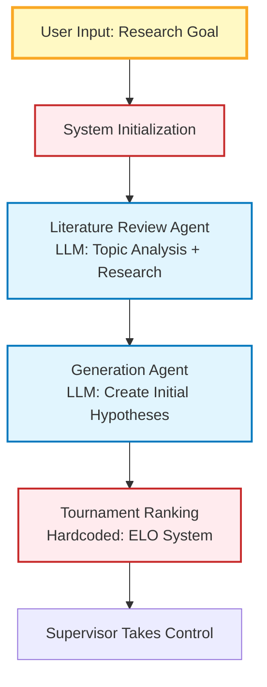
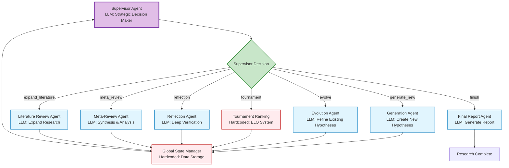
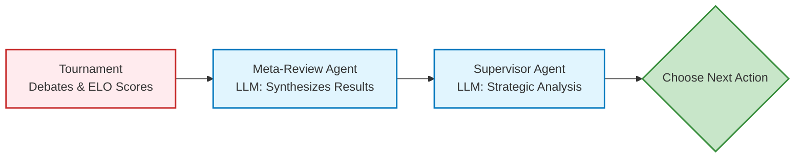
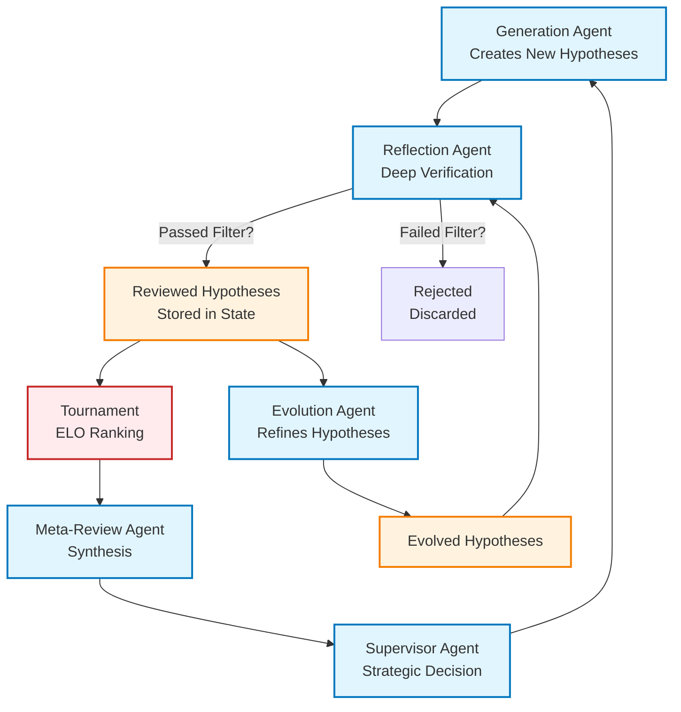

# Co-Scientist Business Flow: Supervisor-Centric View

## Initial Setup (Hardcoded Orchestration)



## Main Research Loop (Supervisor-Driven)



## Key Business Units:

### LLM-Powered Agents (Business Logic):
- **Supervisor Agent**: Strategic decision maker - analyzes research state, decides next action
- **Literature Review Agent**: Topic analysis + research synthesis
- **Generation Agent**: Creates new hypotheses (independent or collaborative)
- **Evolution Agent**: Refines existing hypotheses based on feedback
- **Reflection Agent**: Deep verification and assumption analysis
- **Meta-Review Agent**: Synthesizes tournament results and research progress
- **Final Report Agent**: Generates comprehensive research report

### Hardcoded Systems (Orchestration Logic):
- **Tournament Ranking**: ELO rating system for hypothesis comparison
- **Global State Manager**: Data storage and state coordination
- **Initial Setup**: Hardcoded sequence (Literature → Generation → Tournament → Supervisor)

## What is the Tournament Ranking?

The **tournament ranking** is an **ELO rating system** (like chess ratings) that:

1. **Starts all hypotheses at 1200 ELO** (default rating)
2. **Pits hypotheses against each other** in scientific debates using LLMs
3. **Updates ELO ratings** based on debate outcomes (winner gets higher rating)
4. **Runs two stages**:
   - **Round-robin stage**: Every hypothesis competes against every other hypothesis once
   - **Bracket stage**: Top-ranked hypotheses compete in elimination brackets

### Tournament Output:
- **ELO ratings** for each hypothesis (higher = better)
- **Match history** with debate transcripts
- **Ranking statistics**: top 3 ratings, max rating, median rating, etc.
- **Win/loss records** for each hypothesis

## What Input Does the Supervisor Agent Receive?

The supervisor gets a **comprehensive dashboard** of research state:

### Core Research Data:
- **Research Goal** (user's original input)
- **Latest Meta Review** (synthesis of tournament results)
- **Previous Meta Review** (for trend analysis)

### Tournament Statistics:
- **Total matches played** (how many debates happened)
- **Total rounds played** (total debate rounds)
- **Top 3 ELO ratings** (best performing hypotheses)
- **Max ELO rating** (highest rated hypothesis)
- **Number of ELO ratings over 1400** (high-quality hypotheses)
- **Median ELO rating** (overall quality distribution)

### Research Progress Metrics:
- **Total actions taken** (how many supervisor decisions made)
- **Latest actions** (recent decision history)
- **Total hypotheses** (how many hypotheses exist)
- **Unranked hypotheses** (hypotheses not yet in tournament)
- **New hypotheses since meta-review** (recent additions)
- **Literature review subtopics completed** (research breadth)

### Diversity Metrics:
- **Cosine similarity trajectory** (how similar hypotheses are)
- **Cluster count trajectory** (how many distinct research directions)

## Supervisor's Decision Process:

The supervisor analyzes this data to decide:
- **Are we making progress?** (ELO ratings improving?)
- **Do we need more diversity?** (similarity/cluster metrics)
- **Are we stuck?** (meta-review trends)
- **What's the next priority?** (unranked hypotheses, new directions, etc.)

Then it chooses ONE action from 6 options to advance the research.

## What Are Hypotheses?

A **hypothesis** is a scientific proposal that contains:

```python
class ParsedHypothesis:
    uid: str                          # Unique ID (UUID)
    hypothesis: str                   # Main hypothesis statement
    predictions: list[str]            # Falsifiable predictions (1-3 items)
    assumptions: list[str]            # Assumptions made
    parent_uid: str | None           # Link to parent hypothesis (if evolved)
```

### Example Hypothesis:
```markdown
# Hypothesis
"Chronic exposure to microplastics in diet leads to gut microbiome dysbiosis, 
resulting in increased intestinal permeability and systemic inflammation."

# Falsifiable Predictions
1. Mice fed microplastic-contaminated diet will show reduced microbial diversity 
   compared to controls, measurable by 16S rRNA sequencing
2. Increased levels of LPS in blood plasma of microplastic-fed mice vs controls
3. Intestinal barrier integrity will be compromised, shown by decreased TEER values

# Assumptions
1. Microplastics can reach the gut intact from dietary sources
2. Gut microbiome changes can be measured within the experimental timeframe
3. Intestinal permeability changes are detectable and causally linked to microbiome shifts
```

## User Flow: From Prompt to Hypotheses

**1. User provides research goal:**
```
"How can we prevent cognitive decline in aging populations?"
```

**2. Literature Review Agent reads the goal:**
- Analyzes topic
- Decomposes into subtopics (e.g., "neuroprotection", "exercise", "diet", "sleep")
- Uses GPT Researcher to get scientific papers
- Creates comprehensive literature review

**3. Generation Agent creates initial hypotheses:**
- Reads: research goal + literature review
- Generates 4-8 different scientific hypotheses
- Each hypothesis includes: statement + predictions + assumptions
- Example hypotheses:
  - "Regular exercise prevents cognitive decline via BDNF upregulation"
  - "Mediterranean diet reduces dementia risk through anti-inflammatory pathways"
  - "Sleep quality modulates amyloid clearance mechanisms"

**4. Tournament ranks hypotheses:**
- Each hypothesis starts at 1200 ELO
- Hypothesis A vs Hypothesis B → LLM debate → winner gets higher rating
- Round-robin: every hypothesis debates every other hypothesis
- Result: ranked list with ELO scores (higher = better)

**5. Supervisor gets first set of ranked results:**
- Best hypothesis: "Exercise prevents decline" (ELO: 1450)
- Second best: "Diet reduces dementia" (ELO: 1400)
- Third: "Sleep modulates amyloid" (ELO: 1350)
- etc.

**6. Supervisor makes strategic decisions:**
- "These are all good but similar... let's generate new directions"
- "Quality is improving... let's evolve top hypotheses"
- "Enough diversity... let's finish and report"

So **hypotheses** are the **scientific proposals** that the system generates, debates, and refines to answer your research goal.

## How Does the Supervisor "Review"?

The supervisor **doesn't directly review individual hypotheses**. Instead, it:

### 1. Reads Meta-Reviews (from Meta-Review Agent):
The supervisor receives **meta-reviews** from a **Meta-Review Agent** which:
- Synthesizes all tournament debates
- Identifies strengths and weaknesses of hypotheses
- Analyzes research trends and progress
- Provides strategic insights

### 2. Analyzes Statistics Dashboard:
The supervisor analyzes aggregated data:
- **ELO ratings** (quality metrics)
- **Match history** (how many debates happened)
- **Diversity metrics** (similarity trajectories, cluster counts)
- **Hypothesis inventory** (how many, how many unranked, etc.)

### 3. Makes Strategic Decisions:
Based on this data, the supervisor decides which **agent to invoke next**:
- `generate_new_hypotheses` → invokes Generation Agent
- `evolve_hypotheses` → invokes Evolution Agent
- `run_tournament` → invokes Tournament (hardcoded ELO system)
- `run_meta_review` → invokes **Meta-Review Agent** (creates synthesis)
- `expand_literature_review` → invokes Literature Review Agent
- `finish` → invokes Final Report Agent

### The Review Chain:



## Answer: Supervisor Uses These Agents for Review:

1. **Meta-Review Agent** - Synthesizes tournament debates and creates review summaries
2. **Supervisor Agent itself** - Uses LLM to analyze the meta-reviews and statistics to make strategic decisions

The supervisor **does NOT use other agents directly** to review hypotheses. It reads the **outputs** from:
- Tournament (ELO scores, match results)
- Meta-Review Agent (synthesis of tournament results)
- Global state (statistics dashboard)

Then the supervisor makes strategic decisions about what action to take next.

## Who Calls the Reflection Agent and When?

**Answer: The Framework calls it automatically after hypothesis generation.**

### The Flow:

1. **User/Supervisor calls** `generate_new_hypotheses()`
2. **Generation Agent creates hypotheses** and adds them to the system
3. **Framework automatically calls** `process_reflection_queue()`
4. **Reflection Agent is invoked** for EACH newly generated hypothesis
5. **Reflection Agent performs deep verification**:
   - Desk reject (quick filter)
   - Assumption decomposition
   - Research on assumptions
   - Hypothesis simulation (causal reasoning)
   - Deep verification (final review)

### When Reflection Happens:

```python
async def generate_new_hypotheses():
    # Step 1: Generate hypotheses
    for i in range(n_hypotheses):
        self._generate_new_hypothesis()  # Creates hypothesis
    
    # Step 2: AUTOMATIC - Process reflection queue
    self.process_reflection_queue()      # Calls Reflection Agent
    
    # Step 3: Update proximity graph
    self.state_manager.update_proximity_graph_edges()
```

### Reflection Agent Details:

The Reflection Agent performs **deep verification** with:
- **Desk reject node**: Quick filter to reject obviously bad hypotheses
- **Assumption decomposer**: Breaks down hypothesis into detailed assumptions
- **Assumption researcher**: Uses GPT Researcher to verify assumptions
- **Hypothesis simulation**: Performs causal reasoning and step-by-step simulation
- **Deep verification**: Final comprehensive review

### Who Calls It:
- **Framework automatically** calls it after hypothesis generation
- **NOT the supervisor** - supervisor only chooses "generate_new_hypotheses" action
- **Automated workflow** - generation always triggers reflection

### What Happens to Results:
- **Reviewed hypotheses** are added to the state manager
- **Passed hypotheses** (that passed desk reject) become "reviewed_hypotheses"
- **Reviewed hypotheses** can then be evolved by the Evolution Agent

## Complete Hypothesis Creation Flow:



### Answer to Your Question:

**Flow for Creating Hypotheses:**
```
Generation Agent → Reflection Agent → Reviewed Hypotheses → Tournament/Meta-Review → Supervisor
```

**What Happens to Results:**

1. **After Generation** → Goes to Reflection Queue
2. **After Reflection** → Reviewed Hypotheses (if passed filter)
3. **Reviewed Hypotheses Can:**
   - Go to **Tournament** (for ELO ranking)
   - Be used by **Evolution Agent** (for refinement)
   - Stay in state for meta-analysis

4. **After Tournament** → Goes to Meta-Review Agent
5. **Meta-Review** → Goes to Supervisor for strategic analysis

### Important Distinction:

- **Generation Agent** creates raw hypotheses (ParsedHypothesis)
- **Reflection Agent** verifies them → creates ReviewedHypotheses
- **Tournament** ranks ReviewedHypotheses
- **Evolution Agent** creates new versions from existing hypotheses

So the complete flow is:
**Generation → Reflection → Reviewed → Tournament/Meta → Supervisor**

## Business Flow Summary:

1. **Initialization Phase** (Hardcoded): User → Literature → Generation → Reflection → Tournament
2. **Research Phase** (Supervisor-Driven): Supervisor analyzes state → decides action → executes agent → updates state → repeat
3. **Completion Phase**: Supervisor decides "finish" → Final Report Agent → Done

The supervisor is the **strategic brain** that drives the research process, but it's not the first agent to touch user input.
