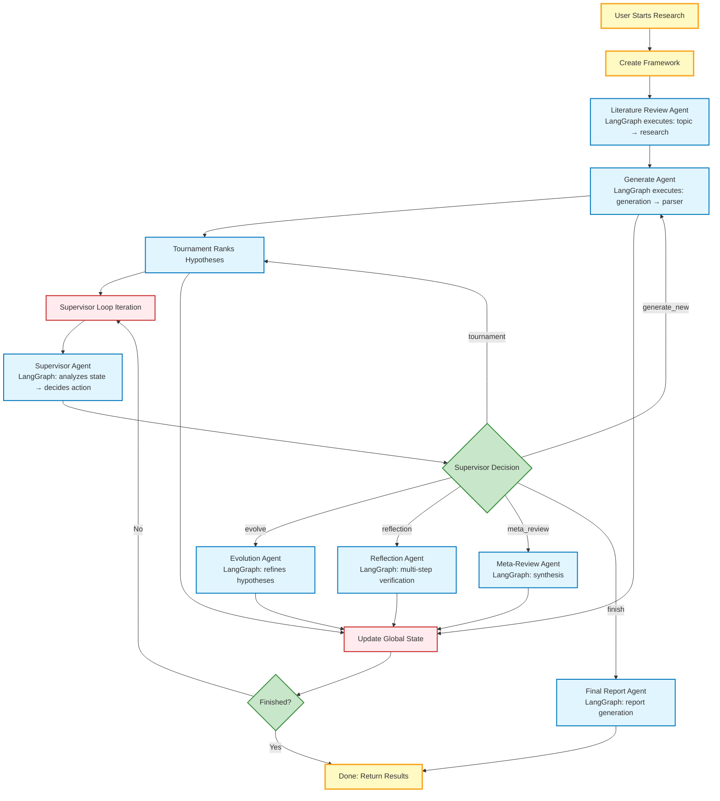

# How Co-Scientist Actually Works: The Real Execution Flow

## Main Loop: What Actually Happens

## Key Points:

1. **No agent calls another agent** - Agents never directly invoke each other
2. **Supervisor is a "traffic controller"** - It's a LangGraph that analyzes system state and picks ONE action from 6 hardcoded options
3. **Framework executes the action** - After supervisor decides, framework calls the corresponding method (e.g., `await self.generate_new_hypotheses()`)
4. **State is global** - All agents read/write to CoscientistStateManager
5. **No cross-agent composition** - Framework can't create custom workflows spanning multiple agents

## What "Supervisor Decision" Actually Means:

The supervisor agent is like a **traffic controller** that:
- Analyzes current research state (hypotheses, rankings, meta-reviews, etc.)
- Uses an LLM to decide what to do next
- Returns ONE action from this hardcoded list:
  - `generate_new_hypotheses` → calls Generation Agent
  - `evolve_hypotheses` → calls Evolution Agent  
  - `run_tournament` → runs tournament ranking
  - `run_meta_review` → calls Meta-Review Agent
  - `expand_literature_review` → calls Literature Review Agent
  - `finish` → calls Final Report Agent

**Yes, the supervisor DOES invoke other agents** - it's just that the framework code handles the actual `.invoke()` calls. The supervisor is the "brain" that decides which agent to run next.

## Framework Architecture:

- **CoscientistFramework** = Custom Python class (NOT LangGraph/LangChain)
- **Individual Agents** = LangGraph StateGraphs (built with LangGraph)
- **Framework orchestration** = Custom Python while loop + method dispatch

So the architecture is:
- **LangGraph**: Used for individual agent workflows (each agent is a StateGraph)
- **Custom Python**: Used for the main orchestration loop and agent coordination
- **LangChain**: Used for LLM interfaces and embeddings

## What This Means:

- ✅ **Good**: Each agent internally is dynamic with complex LangGraph workflows
- ❌ **Bad**: Framework can't compose agents into larger dynamic workflows
- ❌ **Bad**: No conditional orchestration (e.g., "if quality < X, run reflection")
- ❌ **Bad**: All orchestration is hardcoded in the framework's `available_actions()` method

## Code Reference

If you want to see the actual LangGraph code for individual agents:

- **Supervisor Agent**: `coscientist/supervisor_agent.py::build_supervisor_agent()`
- **Literature Review Agent**: `coscientist/literature_review_agent.py::build_literature_review_agent()`
- **Generation Agent**: `coscientist/generation_agent.py::build_generation_agent()`
- **Reflection Agent**: `coscientist/reflection_agent.py::build_deep_verification_agent()`
- **Evolution Agent**: `coscientist/evolution_agent.py::build_evolution_agent()`
- **Meta-Review Agent**: `coscientist/meta_review_agent.py::build_meta_review_agent()`
- **Final Report Agent**: `coscientist/final_report_agent.py::build_final_report_agent()`
- **Framework Loop**: `coscientist/framework.py::run()` (line 496)
- **Global State**: `coscientist/global_state.py::CoscientistStateManager`
